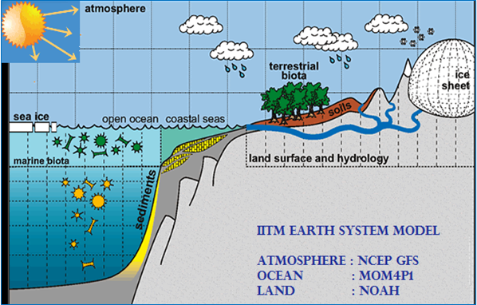
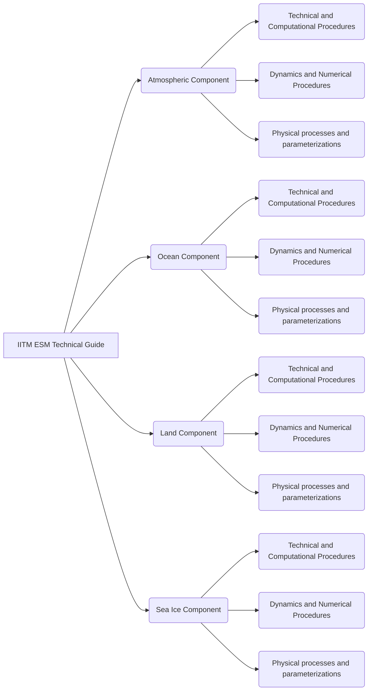
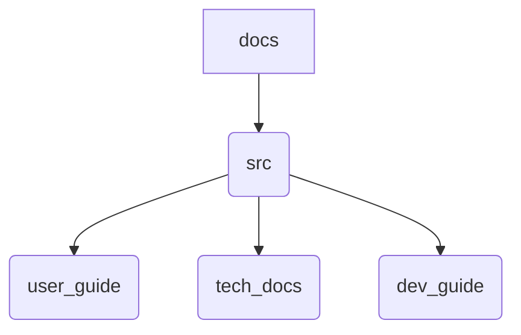

# Model documentation 

## How to Contribute

This documention is a collection of files written in **Markdown**.

## Why Markdown?

>The idea for Markdown is to make it **easy to read, write, and edit prose**. HTML is a publishing format; Markdown is a writing format.
>
>–John Gruber

Note: I just highlighted this quote simply using ">" syntax.

## Markdown Syntax

Listed below are the most frequently used markdown syntax you might encounter while writing this documentation:

### Adding Links and URLs

#### Links

To create a link, enclose the link text in brackets (e.g., [IITM Earth System Model]) and then follow it immediately with the URL in parentheses (e.g., (http://cccr.tropmet.res.in/home/clim_esm_one.jsp))

Example: 

    The [IITM Earth System Model](http://cccr.tropmet.res.in/home/clim_esm_one.jsp) is the first model from India to participate in IPCC assessment reports.

Ouput:

The [IITM Earth System Model](http://cccr.tropmet.res.in/home/clim_esm_one.jsp) is the first model from India to participate in IPCC assessment reports.

#### URL

Example:

    <https://github.com/iitm-esm/iitm-esm/>

Output:

<https://github.com/iitm-esm/iitm-esm/>

### Adding a code snippet (or command) 

    `code`

Example:

`git clone https://github.com/iitm-esm/iitm-esm.git`

### Cross-referencing

Lets say a user wants to link the User guide in the current text. This can be done using

    [text](path)

Example: 
 Link to [user guide](../user_guide/index.md)

### Adding list 

List can be ordered and unordered. Below is an example of an ordered list.

1. User Guide
2. Technical Guide
    1. Atmospheric Component 
    2. Ocean Component

An unordered list can be styled using dashes (-), asterisks (*), or plus signs (+). And Indent one or more items to create a nested list.

- User Guide
- Technical Guide
    - Atmospheric Component 
    - Ocean Component

### Adding Images

Images are prefaced with an exclamation point ( ! ).

    

Note: The alt attribute provides alternative information for an image if a user for some reason cannot view it (because of slow connection, an error in the src attribute, or if the user uses a screen reader).

For example, I wish to add a schematic of the IITM Earth System Model. I would write this in markdown:

    


Oops! Adding a caption to Markdown isn't easy. So What do we do now? 

> For any markup that is not covered by Markdown’s syntax, you simply use HTML itself.
>
> –John Gruber

Using the figure and figcaption HTML tags, a caption can be added to the above image as shown in the example below.

    <figure>
        
        <figcaption>IITM Earth System Model</figcaption>
    </figure>

<figure>
    
    <figcaption>IITM Earth System Model</figcaption>
</figure>

However, If your Markdown application doesn’t support HTML, you could try placing the caption directly below the image and using emphasis. 

    
    *IITM Earth System Model*


*IITM Earth System Model*

### Adding a Table

Data tables can be used at any position in your project documentation and can contain arbitrary Markdown, including inline code blocks. In the example below, the git commands are mentioned in method column and the functionality is described in the second column. 

    | Method      | Description                          |
    | ----------- | ------------------------------------ |
    | `CHECKOUT`   |   To swap between branches   |
    | `COMMIT`     | To commit the new  version |
    | `PULL`    | To pull the updates from github repo |

| Method      | Description                          |
| ----------- | ------------------------------------ |
| `CHECKOUT`       |   To swap between branches   |
| `COMMIT`       | To commit the new  version |
| `PULL`    | To pull the updates from github repo |

### Adding symbols

Markdown doesn’t provide special syntax for symbols. There are two ways to add symbols in your markdown file. 

#### Option 1 
Simply copy and paste the symbol you want in your markdown. It works in most of the cases. For example, I want to add the symbol pi in this document. So, I will search symbol for pi on the web and copy and paste it here. 
    
    π

#### Option 2
A more elegant way is to use HTML entity for the symbol you want to use. For example, if you want to display the copyright sign (©), you can copy and paste the HTML entity for copyright (&copy;) into your Markdown document.

    <p>I am displaying &copy</p>

The output:
<p>I am displaying &copy</p>

### Adding Footnote References

The current theme of MkDocs has an extension "footnotes" which provides the functionality to easily  define inline footnotes. A footnote reference is enclosed in square brackets and must start with a caret ^, directly followed by an arbitrary identifier.

    The IITM-ESM[^1] will be the first climate model from India that will be participating in the Coupled Modeling Intercomparison Project- Phase 6[^2] (CMIP6) experiments required for the Intergovernmental Panel on Climate Change[^3] (IPCC) 6th Assessment Report.    

The IITM-ESM[^1] will be the first climate model from India that will be participating in the Coupled Modeling Intercomparison Project- Phase 6[^2] (CMIP6) experiments required for the Intergovernmental Panel on Climate Change (IPCC) 6th Assessment Report.  

[^1]: Krishnan R, Swapna P, Choudhury AD, Narayansetti S, Prajeesh AG, Singh M, Modi A, Mathew R, Vellore R, Jyoti J, Sabin TP. The IITM Earth System Model (IITM ESM). arXiv preprint arXiv:2101.03410. 2021 Jan 9.
[^2]: Eyring, V., Bony, S., Meehl, G. A., Senior, C. A., Stevens, B., Stouffer, R. J., and Taylor, K. E.: Overview of the Coupled Model Intercomparison Project Phase 6 (CMIP6) experimental design and organization, Geosci. Model Dev., 9, 1937-1958, doi:10.5194/gmd-9-1937-2016, 2016.

### Adding Equations

MkDocs has a beautiful functionality "MathJax" to display mathematical content in the browser.
For inline formulas, enclose the formula in $…$. For displayed formulas, use $$…$$.

A sample equation:

    $$
    \operatorname{ker} f=\{g\in G:f(g)=e_{H}\}{\mbox{.}}
    $$

Output:

$$
\operatorname{ker} f=\{g\in G:f(g)=e_{H}\}{\mbox{.}}
$$

### Adding Diagrams

Diagrams help to communicate complex relationships and interconnections between different technical components, and are a great addition to project documentation.  Mermaid.js is the functionality which helps to add elegant diagrams to your markdown.

Diagrams can be in the form of flowcharts, sequence diagrams,  pie charts, gantt charts, etc. 
Flowcharts are diagrams that represent workflows or processes. An example of Flowchart:

Lets say, the user wishes to explain the directory structure of IITM ESM Technical Guide with the help of a flowchart. My code would look like:

    ```mermaid
    graph LR
    A[IITM ESM Technical Guide] --> B(Atmospheric Component)
    A --> C(Ocean Component)
    A --> D(Land Component)
    A --> E(Sea Ice Component)
    B --> F(Technical and Computational Procedures)
    B --> G(Dynamics and Numerical Procedures)
    B --> H(Physical processes and parameterizations)
    C --> I(Technical and Computational Procedures)
    C --> J(Dynamics and Numerical Procedures)
    C --> K(Physical processes and parameterizations)
    D --> L(Technical and Computational Procedures)
    D --> M(Dynamics and Numerical Procedures)
    D --> N(Physical processes and parameterizations)
    E --> O(Technical and Computational Procedures)
    E --> P(Dynamics and Numerical Procedures)
    E --> Q(Physical processes and parameterizations)
    ```

The Output:


**Note**: for a horizontal Top to botton Graph representation, use "graph TD" in code. More graph representations can be found [here](https://support.typora.io/Draw-Diagrams-With-Markdown/#flowcharts-1)

### Adding lineBreaks 

You can use two or more spaces (commonly referred to as “trailing whitespace”) for line breaks in markdown. However, it’s hard to see trailing whitespace in an editor, and many people accidentally or intentionally put two spaces after every sentence. For this reason, you may want to use something other than trailing whitespace for line breaks. Hence, you can use the HTML tag <br> for adding a linebreak to your text.

For example:
    
    <p>This is the first line.<br>
    And this is the second line.</p>

The Output:

<p>This is the first line.<br>
And this is the second line.</p>

### Adding Emphasis to your text

#### Bold 

To bold text, add two asterisks or underscores before and after a word or phrase. To bold the middle of a word for emphasis, add two asterisks without spaces around the letters.

Example code:

    The **IITM Earth System Model** (IITM-ESM), developed recently at **CCCR, IITM**

Output:

The **IITM Earth System Model** (IITM-ESM), developed recently at **CCCR, IITM**

#### Italics

To italicize text, add one asterisk or underscore before and after a word or phrase. To italicize the middle of a word for emphasis, add one asterisk without spaces around the letters.

Example code:

    The *IITM Earth System Model* (IITM-ESM)*, developed recently at *CCCR, IITM*

Output:

The *IITM Earth System Model* (IITM-ESM), developed recently at *CCCR, IITM*

### Adding Comments

To add a comment, place text inside brackets followed by a colon, a space, and a pound sign (e.g., [comment]: #). You should put blank lines before and after a comment.

For example: 

    Here's a paragraph that will be visible.
    [This is a comment that will be hidden.]: # 
    And here's another paragraph that's visible.

The Output: 
Here's a paragraph that will be visible.

[This is a comment that will be hidden.]: # 

And here's another paragraph that's visible.

## Documentation directory structure

IITM-ESM documentation follows a standard documentation approach. The documentation consists of three main guides:
1. User Guide
2. Technical Documentation
3. Developers Guide

 
 
 and is depicted in the flowchart below:



## References

<https://www.markdownguide.org/hacks/#image-captions>
<https://squidfunk.github.io/mkdocs-material/>


